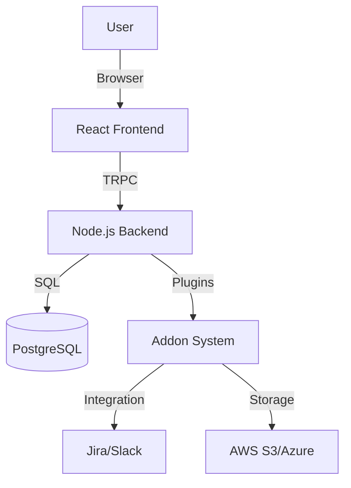

# GRCompliance

<div align="center">


**The Open Source Operating System for Governance, Risk, and Compliance.**

[](https://opensource.org/licenses/MIT)
[](https://www.typescriptlang.org/)
[](https://reactjs.org/)
[](http://makeapullrequest.com)

[Features](#-key-features) • [Why GRCompliance?](#-why-grcompliance) • [Getting Started](#-getting-started) • [Architecture](#-architecture) • [Contributing](#-contributing)

</div>

---

## 🚀 Overview

**GRCompliance** is a comprehensive, open-source GRC (Governance, Risk, and Compliance) platform designed to democratize security compliance. It replaces fragmented spreadsheets and expensive enterprise tools with a modern, unified operating system for security teams.

Whether you are a startup aiming for **SOC 2 Type I** or an enterprise managing complex **ISO 27001** and **GDPR** frameworks, GRCompliance provides the primitives to build, manage, and automate your compliance program.

## ✨ Key Features

### 🛡️ Unified Control Framework
Define your controls once and map them to multiple standards automatically.
- **Multi-Framework Support**: Built-in support for ISO 27001, SOC 2, HIPAA, PCI-DSS, NIST 800-53, and GDPR.
- **Smart Mapping**: Our "Mesh" architecture ensures that one implemented control satisfies requirements across multiple frameworks.
- **Harmonization**: Automatically identify overlapping requirements to reduce audit fatigue.

### 📊 Automated Risk Management
Move beyond static risk registers with a dynamic, ISO 31000-aligned risk engine.
- **Visual Heatmaps**: Real-time visualization of your risk landscape.
- **Asset-Based Risk**: Link risks directly to your assets, vendors, and processes.
- **Treatment Plans**: Track remediation tasks and accept, transfer, or mitigate risks with audit trails.

### 🔌 Modular Addon System
Extensible architecture allowing you to connect your favorite tools.
- **Integrations**: Connect Jira, Slack, GitHub, and more.
- **Storage Providers**: Bring your own storage (AWS S3, Azure Blob, Google Cloud).
- **Templates**: Marketplace for policy packs and assessment templates.
- **Developer Friendly**: easy-to-use API for building your own [Custom Addons](./docs/ADDON_SYSTEM.md).

### 🏢 Business Continuity & Disaster Recovery
Built-in tools to keep your business running during disruptions.
- **BIA (Business Impact Analysis)**: Calculate RTOs and RPOs with guided workflows.
- **Recovery Plans**: Create and test actionable disaster recovery plans.
- **Call Trees**: Manage emergency contacts and communication protocols.

### 🔍 Audit Hub
Streamline your external audits.
- **Evidence Collection**: Centralized repository for all compliance evidence.
- **Auditor Access**: specific views for auditors to review controls without accessing sensitive internal data.
- **Snapshotting**: "Freeze" your compliance state for point-in-time audits.

### 🔒 Privacy Center
Manage your data privacy obligations in one place.
- **ROPA**: Record of Processing Activities generator.
- **DSAR Management**: Workflow for handling Data Subject Access Requests.
- **DPIA**: Data Protection Impact Assessments for high-risk processing.

### 🏛️ Federal & Government Compliance
Dedicated tools for defense contractors and federal agencies.
- **NIST 800-171 / CMMC**: Specialized workflows for CMMC readiness.
- **SSP Editor**: Generator for System Security Plans.
- **POAM Tracker**: Plan of Action and Milestones tracking for federal audits.
- **FIPS 199**: Categorization wizard for federal information systems.

### 🤝 Third-Party Risk Management (TPRM)
End-to-end vendor risk lifecycle management.
- **Vendor Onboarding**: Workflows for assessing and onboarding new vendors.
- **Security Reviews**: Automated questionnaires and risk scoring.
- **Contract Management**: Track DPAs (Data Processing Agreements) and security addendums.
- **Vendor Catalog**: Centralized database of all third-party suppliers.

### 🛡️ Cyber Resilience
Prepare for and respond to cyber incidents.
- **Incident Reporting**: Centralized logging and tracking of security incidents.
- **Cyber Assessments**: Regular maturity assessments against cyber frameworks.


## ⚖️ Why GRCompliance?

| Feature | 🚀 GRCompliance | 📉 Spreadsheets | 🏢 Commercial (Vanta/Drata) |
| :--- | :---: | :---: | :---: |
| **Cost** | **Free (Open Source)** | Free | $15,000+ / year |
| **Data Privacy** | **Your Cloud / On-Prem** | Local Files | Third-Party Cloud |
| **Customization** | **Unlimited (Code access)** | High | Rigid / Restricted |
| **Extensibility** | **Open Addon System** | None | Closed Ecosystem |
| **Lock-in** | **None** | None | High (Proprietary Data) |
| **Automation** | **Automated Evidence** | Manual | Automated |

## 🏗️ Architecture



## 🛠️ Tech Stack

GRCompliance is built with a modern, type-safe stack designed for performance and developer experience.

- **Frontend**: React 18, TypeScript, Tailwind CSS, Shadcn UI
- **Backend**: Node.js, Express
- **API**: TRPC (End-to-end type safety)
- **Database**: PostgreSQL
- **ORM**: Drizzle ORM
- **Authentication**: JWT / OAuth2

## 🚀 Getting Started

### Prerequisites
- Node.js 18+
- PostgreSQL 15+

### Installation

1.  **Clone the repository**
    ```bash
    git clone https://github.com/sectutor/ComplianceOS.git GRCompliance
    cd GRCompliance
    ```

2.  **Install dependencies**
    ```bash
    npm install
    ```

3.  **Configure Environment**
    ```bash
    cp .env.example .env
    # Update .env with your database credentials
    ```

4.  **Initialize Database**
    ```bash
    npm run db:push
    ```

5.  **Run Development Server**
    ```bash
    # Run both frontend and backend
    npm run dev
    npm run server
    ```

Visit `http://localhost:5173` to start using GRCompliance.

## 📚 Documentation

Detailed documentation is available in the [`docs/`](./docs) directory:

- [**Addon Development Guide**](./docs/ADDON_SYSTEM.md)
- [**Architecture Overview**](./docs/architecture.md)
- [**API Reference**](./docs/api-reference.md)
- [**Database Schema**](./docs/database-schema.md)

## 🤝 Contributing

We welcome contributions from the community! Whether it's fixing bugs, adding new frameworks, or building addons, your help is appreciated.

Please read our [Contributing Guide](./CONTRIBUTING.md) to get started.

## 📄 License

This project is licensed under the MIT License - see the [LICENSE](./LICENSE) file for details.

---

<div align="center">
  Built with ❤️ by the Open Source Security Community
</div>
